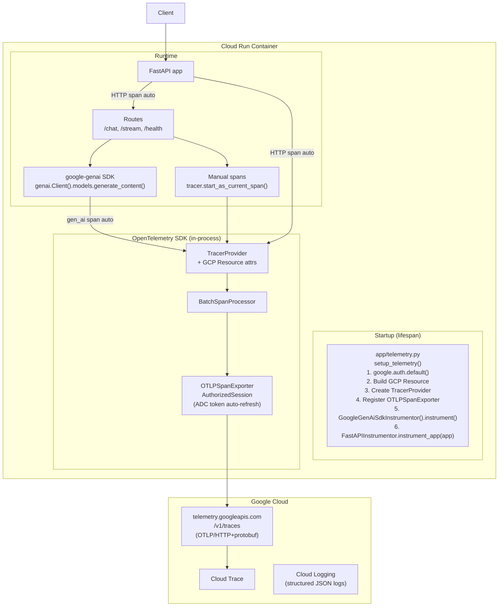

# Plan 1: FastAPI + Gemini LLM Calls — Full OTEL Tracing → Cloud Trace

## Architecture overview



---

## Span hierarchy in Cloud Trace

```
HTTP POST /chat                         ← FastAPIInstrumentor auto-span
  └── process_chat_request              ← your manual span (optional)
        └── generate_content gemini-*   ← GoogleGenAiSdkInstrumentor auto-span
              attrs: gen_ai.system, gen_ai.request.model,
                     gen_ai.usage.input_tokens, gen_ai.usage.output_tokens,
                     gen_ai.response.finish_reasons
```

---

## Project file layout

```
my-app/
├── app/
│   ├── main.py            # FastAPI app, lifespan, FastAPIInstrumentor
│   ├── telemetry.py       # TracerProvider bootstrap (call once at startup)
│   ├── routes/
│   │   └── chat.py        # Route handlers with optional manual spans
│   └── services/
│       └── llm.py         # Gemini SDK calls (auto-traced)
├── pyproject.toml
└── Dockerfile
```

---

## Dependencies (`pyproject.toml`)

```toml
[project]
dependencies = [
    # Web framework
    "fastapi>=0.110",
    "uvicorn[standard]>=0.29",

    # Gemini LLM
    "google-genai>=1.75",       # google-genai SDK (version verified in venv)
    "google-auth>=2.53",        # ADC credential handling

    # OTel core
    "opentelemetry-sdk>=1.41.1",
    "opentelemetry-semantic-conventions>=0.62b1",

    # Exporter — OTLP/HTTP → telemetry.googleapis.com (same path ADK uses)
    "opentelemetry-exporter-otlp-proto-http>=1.41.1",

    # GCP resource detection for Cloud Run (auto-detects service, revision, region)
    "opentelemetry-resourcedetector-gcp>=1.12.0a0",

    # Auto-instrumentation
    "opentelemetry-instrumentation-fastapi>=0.62b1",  # every HTTP route
    "opentelemetry-instrumentation-google-genai>=0.7b1", # every LLM call
]
```

---

## `app/telemetry.py`

```python
import logging
import os
import google.auth
from google.auth.transport.requests import AuthorizedSession
from opentelemetry import trace
from opentelemetry.sdk.resources import Resource, OTELResourceDetector
from opentelemetry.sdk.trace import TracerProvider
from opentelemetry.sdk.trace.export import BatchSpanProcessor
from opentelemetry.exporter.otlp.proto.http.trace_exporter import OTLPSpanExporter

_GCP_TRACES_ENDPOINT = "https://telemetry.googleapis.com/v1/traces"
logger = logging.getLogger(__name__)

def setup_telemetry() -> None:
    """Bootstrap OTel TracerProvider with GCP Cloud Trace export.

    Must be called ONCE at app startup, before any tracer is obtained.
    Mirrors the exact approach google-adk uses in _setup_gcp_telemetry().
    """
    credentials, project_id = google.auth.default()
    if not project_id:
        logger.warning("GOOGLE_CLOUD_PROJECT not resolved — trace export will fail")

    # Build resource: Cloud Run attrs (service name, revision, region) added by GCP detector
    service_name = os.getenv("SERVICE_NAME", "my-app")
    service_version = os.getenv("COMMIT_SHA", "dev")

    base_resource = Resource({
        "service.name": service_name,
        "service.version": service_version,
        "gcp.project_id": project_id or "",
    })

    try:
        from opentelemetry.resourcedetector.gcp_resource_detector import GoogleCloudResourceDetector
        resource = (
            base_resource
            .merge(OTELResourceDetector().detect())           # reads OTEL_RESOURCE_ATTRIBUTES, OTEL_SERVICE_NAME
            .merge(GoogleCloudResourceDetector(raise_on_error=False).detect())  # Cloud Run: K_SERVICE, K_REVISION, etc.
        )
    except ImportError:
        logger.warning("GCP resource detector not installed; using base resource only")
        resource = base_resource.merge(OTELResourceDetector().detect())

    # OTLP exporter with Google-authorized HTTP session (token auto-refreshed by AuthorizedSession)
    # Same pattern as ADK's _get_gcp_span_exporter()
    session = AuthorizedSession(credentials=credentials)
    exporter = OTLPSpanExporter(session=session, endpoint=_GCP_TRACES_ENDPOINT)

    # Build and register TracerProvider globally
    provider = TracerProvider(resource=resource)
    provider.add_span_processor(BatchSpanProcessor(exporter))
    trace.set_tracer_provider(provider)
    logger.info("TracerProvider configured → %s (project: %s)", _GCP_TRACES_ENDPOINT, project_id)

    # Auto-instrument all google-genai SDK calls
    try:
        from opentelemetry.instrumentation.google_genai import GoogleGenAiSdkInstrumentor
        GoogleGenAiSdkInstrumentor().instrument()
        logger.info("GoogleGenAiSdkInstrumentor activated")
    except ImportError:
        logger.warning("opentelemetry-instrumentation-google-genai not installed")
```

---

## `app/main.py`

```python
import os
from contextlib import asynccontextmanager
from fastapi import FastAPI
from opentelemetry.instrumentation.fastapi import FastAPIInstrumentor
from app.telemetry import setup_telemetry

@asynccontextmanager
async def lifespan(app: FastAPI):
    # TracerProvider MUST be set before any request is served
    setup_telemetry()
    yield
    # Graceful shutdown: flush in-flight spans before container stops
    from opentelemetry import trace
    provider = trace.get_tracer_provider()
    if hasattr(provider, "shutdown"):
        provider.shutdown()

app = FastAPI(lifespan=lifespan)

# instrument_app patches the middleware stack; safe to call at module level
# because it reads the TracerProvider lazily at request time
FastAPIInstrumentor.instrument_app(app)

from app.routes import chat
app.include_router(chat.router)
```

---

## `app/routes/chat.py` — manual spans

```python
from fastapi import APIRouter
from opentelemetry import trace

router = APIRouter()
tracer = trace.get_tracer(__name__)    # lazily binds to provider set in lifespan

@router.post("/chat")
async def chat(body: ChatRequest):
    with tracer.start_as_current_span("chat.request") as span:
        span.set_attribute("chat.user_id", body.user_id)
        span.set_attribute("chat.message_len", len(body.message))
        result = await llm_service.generate(body.message)
        span.set_attribute("chat.response_len", len(result))
        return {"response": result}
```

---

## `app/services/llm.py` — Gemini calls (auto-traced)

```python
import google.genai as genai

# No extra OTel code needed here.
# GoogleGenAiSdkInstrumentor wraps generate_content() automatically.
client = genai.Client()

async def generate(prompt: str) -> str:
    response = client.models.generate_content(
        model="gemini-2.0-flash",
        contents=prompt,
    )
    return response.text
```

---

## Environment variables — complete reference

### Required (must be set)

| Variable | Where set | Purpose |
|----------|-----------|---------|
| `GOOGLE_CLOUD_PROJECT` | Cloud Run env / `gcloud run deploy --set-env-vars` | Resolves GCP project for `google.auth.default()`. Without this, `project_id` is `None` and trace export fails silently. |

### Required via credential mechanism (not an env var)

| Mechanism | How | Purpose |
|-----------|-----|---------|
| **Cloud Run Service Account** | `gcloud run deploy --service-account SA@PROJECT.iam.gserviceaccount.com` | Identity for `google.auth.default()`. Must have `roles/cloudtrace.agent`. No key file needed on Cloud Run — uses metadata server. |

### Strongly recommended

| Variable | Example value | Purpose |
|----------|---------------|---------|
| `SERVICE_NAME` | `my-chat-app` | Sets `service.name` on every span — appears as the service label in Cloud Trace. |
| `COMMIT_SHA` | `abc1234` (set by CI) | Sets `service.version` — lets you filter traces by deployment. |
| `GOOGLE_CLOUD_LOCATION` | `us-central1` | Gemini API region. If unset, Gemini SDK defaults to global routing. |

### Optional / observability tuning

| Variable | Example value | Purpose |
|----------|---------------|---------|
| `OTEL_RESOURCE_ATTRIBUTES` | `service.namespace=my-project,env=prod` | Extra resource labels merged onto every span. |
| `OTEL_SERVICE_NAME` | `my-chat-app` | OTel standard override for `service.name` (takes precedence over `SERVICE_NAME` if set). |
| `OTEL_INSTRUMENTATION_GENAI_CAPTURE_MESSAGE_CONTENT` | `NO_CONTENT` or `false` | Controls whether prompt/response text is attached to LLM spans. Default: `false` (no content). Set `NO_CONTENT` for metadata-only. |
| `ALLOW_ORIGINS` | `https://my-ui.example.com` | Comma-separated CORS origins for the FastAPI app. |
| `PORT` | `8080` | Cloud Run injects this; pass to `uvicorn` in Dockerfile `CMD`. |

### Auto-set by Cloud Run (read by GCP resource detector — no action needed)

| Variable | Value (Cloud Run injects) | Appears as span attribute |
|----------|--------------------------|--------------------------|
| `K_SERVICE` | Cloud Run service name | `cloud_run.service` |
| `K_REVISION` | Cloud Run revision | `cloud_run.revision` |
| `K_CONFIGURATION` | Cloud Run config | — |

---

## `Dockerfile`

```dockerfile
FROM python:3.13-slim
WORKDIR /app
COPY pyproject.toml .
RUN pip install .
COPY app/ app/
CMD ["uvicorn", "app.main:app", "--host", "0.0.0.0", "--port", "8080"]
```

---

## Cloud Run IAM — required roles for service account

| Role | Purpose |
|------|---------|
| `roles/cloudtrace.agent` | Write spans to Cloud Trace |
| `roles/aiplatform.user` | Call Gemini API via Vertex Enterprise |

```bash
gcloud projects add-iam-policy-binding PROJECT_ID \
  --member="serviceAccount:SA@PROJECT_ID.iam.gserviceaccount.com" \
  --role="roles/cloudtrace.agent"

gcloud projects add-iam-policy-binding PROJECT_ID \
  --member="serviceAccount:SA@PROJECT_ID.iam.gserviceaccount.com" \
  --role="roles/aiplatform.user"
```

---

## Deploy command

```bash
gcloud run deploy my-chat-app \
  --source . \
  --region us-central1 \
  --service-account my-sa@PROJECT_ID.iam.gserviceaccount.com \
  --set-env-vars SERVICE_NAME=my-chat-app,COMMIT_SHA=$(git rev-parse --short HEAD),GOOGLE_CLOUD_PROJECT=PROJECT_ID,GOOGLE_CLOUD_LOCATION=us-central1
```

---

## What you see in Cloud Trace

Every request creates a trace tree:
```
HTTP POST /chat [200]  — 350ms
  └── chat.request  — 340ms
        └── generate_content gemini-2.0-flash  — 310ms
              gen_ai.usage.input_tokens: 42
              gen_ai.usage.output_tokens: 128
              gen_ai.response.finish_reasons: [STOP]
```
