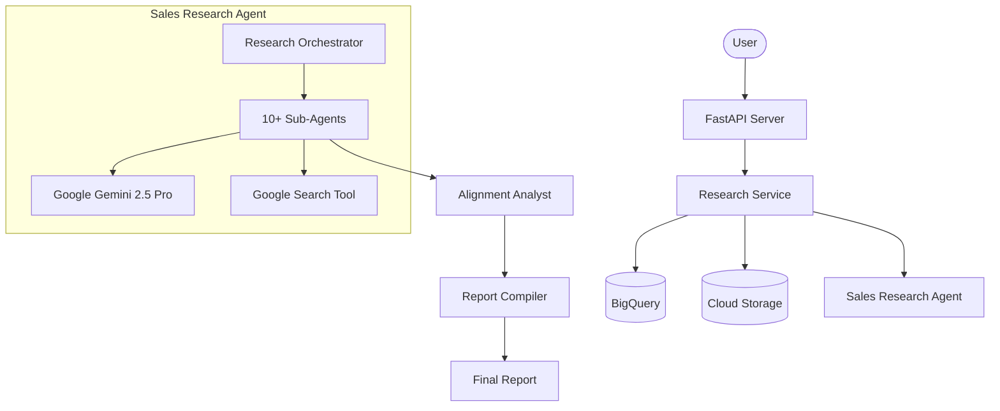

# Colt-AI: Sales Research API

A powerful FastAPI-based agentic system that automates company research and sales alignment analysis using Google's Gemini and Vertex AI.

## 🚀 Overview

Colt-AI orchestrates 10+ specialized AI agents to perform deep-dive research into target companies. It analyzes firmographics, strategy, tech stack, and compliance to generate a comprehensive sales alignment report.

### Key Features
- **Parallel Research Orchestration**: Executes multiple sub-agents concurrently for speed and breadth.
- **Deep Alignment Analysis**: Maps company challenges to specific business solutions.
- **Automated Report Generation**: Compiles multi-agent outputs into a professional markdown report.
- **Cloud Native**: Integrated with Google BigQuery for persistence and GCS for artifact storage.

## 🏗 Architecture



## 🛠 Setup

### Prerequisites
- Python 3.11+
- [uv](https://github.com/astral-sh/uv) (recommended for environment management)

### Installation

1. **Clone the repository:**
   ```bash
   git clone <repository-url>
   cd Colt-AI
   ```

2. **Create and activate virtual environment:**
   ```bash
   uv venv .venv_sales
   source .venv_sales/bin/activate  # On Windows: .venv_sales\Scripts\activate
   ```

3. **Install dependencies:**
   ```bash
   uv pip install -r pyproject.toml
   ```

### Environment Configuration

Create a `.env` file in the root directory based on `.env.example`:

```env
# Google Cloud Configuration
GEMINI_MODEL=gemini-2.5-pro
GOOGLE_GENAI_USE_VERTEXAI=TRUE

GOOGLE_CLOUD_PROJECT=cloud-practice-dev-2
GOOGLE_CLOUD_LOCATION=us-central1

GOOGLE_APPLICATION_CREDENTIALS=path/to/service-account.json
GCS_BUCKET_NAME=colt-ai-usecase
BIGQUERY_DATASET=colt_ingest
BIGQUERY_TABLE=research_requests

# Guardrails Configuration (Optional)
SAFETY_HARASSMENT_THRESHOLD=BLOCK_MEDIUM_AND_ABOVE
SAFETY_HATE_SPEECH_THRESHOLD=BLOCK_MEDIUM_AND_ABOVE
SAFETY_SEXUAL_THRESHOLD=BLOCK_LOW_AND_ABOVE
SAFETY_DANGEROUS_THRESHOLD=BLOCK_ONLY_HIGH
ENABLE_INPUT_VALIDATION=true
MAX_COMPANY_NAME_LENGTH=200
AGENT_EXECUTION_TIMEOUT_SECONDS=1800

LOG_LEVEL=DEBUG
ENVIRONMENT=development

```

### Telemetry Requirements (Google Cloud)

This app uses ADK OpenTelemetry bootstrap semantics (`otel_to_cloud` style) with a direct no-collector export path.

- Enable APIs:
  - `telemetry.googleapis.com`
  - `logging.googleapis.com`
  - `cloudtrace.googleapis.com`
  - `monitoring.googleapis.com`
- Minimum IAM on the runtime identity:
  - `roles/telemetry.tracesWriter`
  - `roles/logging.logWriter`
  - `roles/monitoring.metricWriter`

Telemetry behavior is controlled with `.env` flags such as:

- `OTEL_ENABLED`
- `OTEL_SERVICE_NAME`
- `OTEL_EXPORTER_OTLP_ENDPOINT=https://telemetry.googleapis.com`
- `OTEL_RESOURCE_ATTRIBUTES` (include `gcp.project_id=...`)
- `OTEL_PYTHON_LOGGING_AUTO_INSTRUMENTATION_ENABLED`
- `OTEL_SEMCONV_STABILITY_OPT_IN`
- `ADK_CAPTURE_MESSAGE_CONTENT_IN_SPANS`

Logs are emitted with Cloud Logging correlation fields (`logging.googleapis.com/trace`, `logging.googleapis.com/spanId`, `logging.googleapis.com/trace_sampled`) so you can pivot between logs and traces in GCP.

Detailed setup and troubleshooting steps are in `docs/telemetry-runbook.md`.

### Known Telemetry Follow-ups

- `src/utils/telemetry.py` tracks only agents listed in `_AGENT_TYPE_MAP`; newly added agent names should be added there if they must emit per-agent telemetry rows.

## 🛡️ Guardrails

Colt-AI implements comprehensive safety and security guardrails:

- ✅ **Content Safety**: All 15 AI agents have safety filters for harassment, hate speech, sexual content, and dangerous content
- ✅ **Input Validation**: SQL injection and XSS prevention on all API inputs
- ✅ **Timeout Protection**: 30-minute execution timeout for agent operations
- ✅ **Rate Limiting**: Configurable request limits per hour
- ✅ **Safety Monitoring**: Comprehensive logging of all safety events

**📖 For detailed guardrail documentation, see [GUARDRAILS.md](./GUARDRAILS.md)**

## 🏃 Running the Application

### Development Server
Run the application with hot-reload enabled:
```bash
python main.py
```
Or using uvicorn directly:
```bash
uvicorn src.routes.app:app --reload --host 0.0.0.0 --port 8000
```

### API Documentation
Once running, you can access the interactive API docs at:
- **Swagger UI**: [http://localhost:8000/docs](http://localhost:8000/docs)
- **ReDoc**: [http://localhost:8000/redoc](http://localhost:8000/redoc)

## 📡 API Endpoints

| Method | Endpoint | Description |
|--------|----------|-------------|
| `POST` | `/api/v1/research/initiate` | Submit a new company for research |
| `GET`  | `/api/v1/research/status/{id}` | Check research status |
| `GET`  | `/api/v1/research/result/{id}` | Get research output and download URLs |

## 🛠 Development

### Debugging in VS Code
The project includes a `.vscode/launch.json` optimized for debugging:
- **FastAPI: Debug Server**: Hot-reloading development mode.
- **FastAPI: Debug (No Reload)**: Best for stepping through code.

### Linting & Formatting
We use `ruff` and `pre-commit` to maintain code quality:
```bash
pre-commit run --all-files
```
