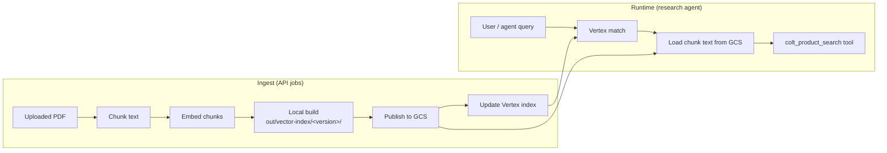

# Product catalog vector index

This document describes how the Colt product catalog is chunked, embedded, stored in GCS, indexed in Vertex AI Vector Search, and queried at runtime.

There is **no bundled PDF** in the repository. Every build that needs source text requires an uploaded catalog PDF via the API.

## High-level flow



### Two paths

| Path | When to use |
|------|-------------|
| **Full rebuild** | One shot: chunk → embed → publish → update index. `POST /catalog/rebuild` with PDF. |
| **Step-by-step jobs** | Prepare locally, publish later, or re-run only index update. `POST /catalog/jobs` with `operation` + optional PDF. |

Version IDs are the first 8 characters of the PDF SHA-256, so the same file always maps to the same version id.

## HTTP layer

| Layer | Path |
|-------|------|
| Routes | `src/routes/catalog.py` |
| Handlers | `src/handlers/catalog_handler.py` |
| Service | `src/services/catalog/service.py` |
| Pipeline | `src/services/catalog/` |

## API base path

All routes live under:

```
/api/v1/catalog
```

Authentication matches the research API (`get_current_user` JWT via `x-app-auth`).

## Endpoints

| Method | Path | Purpose |
|--------|------|---------|
| `GET` | `/status` | Active GCS version, manifest timestamp, index vector count, deploy state |
| `GET` | `/manifest` | Full `manifest.json` from GCS |
| `POST` | `/search` | Test vector search (same logic as the research agent tool) |
| `POST` | `/rebuild` | **Full pipeline** — requires PDF upload (multipart) |
| `POST` | `/jobs` | Start a background job (multipart form fields) |
| `GET` | `/jobs/{job_id}` | Poll job status (BigQuery-backed) |

### PDF upload rules

| Operation | PDF required? |
|-----------|----------------|
| `prepare` | Yes — upload on `POST /jobs` |
| `rebuild` | Yes — upload on `POST /rebuild` or `POST /jobs` |
| `publish` | No — uses PDF already in local build dir from `prepare` |
| `index_update` | No — reads embeddings from GCS for `version_id` |
| `index_deploy` | No |
| `index_create` | No |

Uploaded files are written to `{VECTOR_SEARCH_LOCAL_BUILD_DIR}/tmp/` and passed into the pipeline.

## Job operations

Jobs run in the background (`BackgroundTasks`). Status is stored in BigQuery table `catalog_build_jobs` (see `BIGQUERY_CATALOG_JOBS_TABLE`).

| Operation | What it does |
|-----------|----------------|
| `prepare` | PDF → chunks + embeddings → local `out/vector-index/<version_id>/` (also copies PDF into that folder) |
| `publish` | Upload local build to GCS, update `manifest.json`, copy `current/chunks.json` |
| `index_update` | Push embeddings from GCS into the Vertex index (`version_id` required) |
| `index_deploy` | Deploy index to the configured endpoint |
| `index_create` | Create a new index from a release’s embeddings (rare; infra usually provisions index) |
| `rebuild` | `prepare` → `publish` → `index_update` (optional deploy) in one job |

### Rebuild options (`POST /rebuild`)

Form field `options_json` (JSON string):

```json
{
  "skip_index_update": false,
  "deploy_after": false,
  "deploy_force": false,
  "complete_overwrite": true
}
```

### Job options (`POST /jobs`)

Form field `options_json` (JSON string), same shape as `CatalogJobOptions`:

```json
{
  "skip_publish": false,
  "skip_index_update": false,
  "deploy_after": false,
  "deploy_force": false,
  "complete_overwrite": true
}
```

## Typical workflows

### 1. Full rebuild (most common)

```bash
# Start server
uv run uvicorn src.routes.app:app --host 127.0.0.1 --port 8000

# Rebuild catalog + GCS + Vertex index
curl -X POST http://127.0.0.1:8000/api/v1/catalog/rebuild \
  -F "pdf=@/path/to/ColtProductCatalog.pdf"

# Response: {"job_id":"cat_...","operation":"rebuild","status":"PENDING"}

# Poll until COMPLETED
curl http://127.0.0.1:8000/api/v1/catalog/jobs/cat_<uuid>

# Verify
curl http://127.0.0.1:8000/api/v1/catalog/status
curl -X POST http://127.0.0.1:8000/api/v1/catalog/search \
  -H "Content-Type: application/json" \
  -d '{"query":"SD-WAN managed service"}'
```

### 2. Prepare locally, publish and index later

Useful when you want to inspect chunks before touching GCS or Vertex.

```bash
# Step 1: prepare (PDF required)
curl -X POST http://127.0.0.1:8000/api/v1/catalog/jobs \
  -F "operation=prepare" \
  -F "pdf=@/path/to/catalog.pdf"
# Note version_id from job result, e.g. 63ad7f0b

# Step 2: publish (no PDF — uses local build)
curl -X POST http://127.0.0.1:8000/api/v1/catalog/jobs \
  -F "operation=publish" \
  -F "version_id=63ad7f0b"

# Step 3: update Vertex index
curl -X POST http://127.0.0.1:8000/api/v1/catalog/jobs \
  -F "operation=index_update" \
  -F "version_id=63ad7f0b" \
  -F 'options_json={"complete_overwrite":true}'
```

### 3. GCS-only refresh (index already has vectors)

If artifacts are already in GCS and you only need to re-point the index:

```bash
curl -X POST http://127.0.0.1:8000/api/v1/catalog/jobs \
  -F "operation=index_update" \
  -F "version_id=<existing_version>"
```

## Pipeline stages (code)

Implementation lives under `src/services/catalog/` and is orchestrated by `CatalogService` (`src/services/catalog/service.py`).

```
PDF upload
  → chunking.chunk_pdf()          # pypdf extract + split
  → embeddings.embed_chunks()     # text-embedding-004
  → storage.write_local_artifacts()  # data.json, chunks.json, PDF copy
  → storage.GcsPublisher.publish()   # upload release + manifest
  → vertex.VertexIndexManager.update_index()  # stream update from GCS
```

**Local build layout** (`VECTOR_SEARCH_LOCAL_BUILD_DIR`, default `out/vector-index/`):

```
out/vector-index/
  tmp/                          # uploaded PDFs (temp)
  <version_id>/
    data.json                   # JSONL embeddings for Vertex (id + embedding)
    chunks.json                 # chunk text + source_sha256 metadata
    <original-filename>.pdf     # copy of source PDF
```

## GCS layout

Bucket: `VECTOR_SEARCH_BUCKET` (default `aicoesandox-vector-search`)  
Root prefix: `VECTOR_SEARCH_CATALOG_ROOT` (default `colt-product-catalog`)

```
gs://<bucket>/colt-product-catalog/
  manifest.json                           # active version + release metadata
  current/chunks.json                     # chunk id → text (runtime snippet lookup)
  releases/<version_id>/
    source/ColtProductCatalog.pdf         # fixed object name in GCS
    chunks/chunks.json
    embeddings/data.json                  # Vertex expects .json extension (JSONL body)
```

`manifest.json` records `active_version`, embedding model, chunk settings, and pointers to each release.

## Runtime search (research agent)

The tool `colt_product_search` is implemented in `src/services/catalog/search.py` and wrapped for ADK in `src/services/research/agent/sales/utils/tools.py`:

1. Embeds the query with the same model as the index (`VECTOR_SEARCH_EMBEDDING_MODEL`).
2. Calls `MatchingEngineIndexEndpoint.match()` (PSC IP from `VECTOR_SEARCH_PSC_IP` when set).
3. Loads chunk text from `gs://.../current/chunks.json` to attach readable snippets to neighbor IDs.

This path is **read-only** — it does not rebuild the index.

## Configuration

Key settings in `src/core/config.py` (override via `.env`):

| Variable | Purpose |
|----------|---------|
| `VECTOR_SEARCH_BUCKET` | GCS bucket for catalog artifacts |
| `VECTOR_SEARCH_CATALOG_ROOT` | Prefix under bucket |
| `VECTOR_SEARCH_INDEX_ID` | Vertex Matching Engine index |
| `VECTOR_SEARCH_INDEX_ENDPOINT_ID` | Index endpoint |
| `VECTOR_SEARCH_DEPLOYED_INDEX_ID` | Deployed index id on endpoint |
| `VECTOR_SEARCH_PSC_IP` | Private IP for `match()` from VPC / Cloud Run |
| `VECTOR_SEARCH_EMBEDDING_MODEL` | Must match index training model |
| `VECTOR_SEARCH_LOCAL_BUILD_DIR` | Local prepare output (default `out/vector-index`) |
| `VECTOR_SEARCH_CHUNK_SIZE` / `OVERLAP` | Chunking |
| `BIGQUERY_CATALOG_JOBS_TABLE` | Job status table name |

## GCP prerequisites (not done by the API)

Terraform / console typically provisions:

- GCS bucket and IAM
- Vertex index + PSC endpoint + deployed index
- Service account with `storage` + `aiplatform` access

The API **manages catalog data** (chunks, embeddings, manifest, index updates). It does **not** create the index endpoint or PSC forwarding rule.

## IAM notes

The runtime service account needs at least:

- `roles/storage.objectAdmin` (or equivalent) on the vector bucket
- `roles/aiplatform.user` for embeddings and index updates
- `roles/serviceusage.serviceUsageConsumer` if the client checks bucket metadata via Service Usage API

## Troubleshooting

| Symptom | Likely cause |
|---------|----------------|
| `422` on `/rebuild` | Missing `pdf` form field |
| `400` pdf required for prepare/rebuild | Job started without upload |
| `Catalog PDF upload is required` in failed job | Background job had no `pdf_path` |
| Vertex rejects upload | Embeddings file must be named `data.json` under `embeddings/` |
| Search returns IDs but empty text | `current/chunks.json` missing or IAM 403 on GCS read |
| `No local build at ...` on publish | Run `prepare` first for that `version_id` |

## Related code

| Area | Path |
|------|------|
| Routes | `src/routes/catalog.py` |
| Job orchestration | `src/services/catalog/service.py` |
| Pipeline | `src/services/catalog/pipeline.py` |
| GCS paths | `src/services/catalog/paths.py` |
| Runtime tool | `src/services/agent/sales/utils/tools.py` |
| Tests | `tests/routes/test_catalog_routes.py`, `tests/services/catalog/test_catalog_service.py` |
