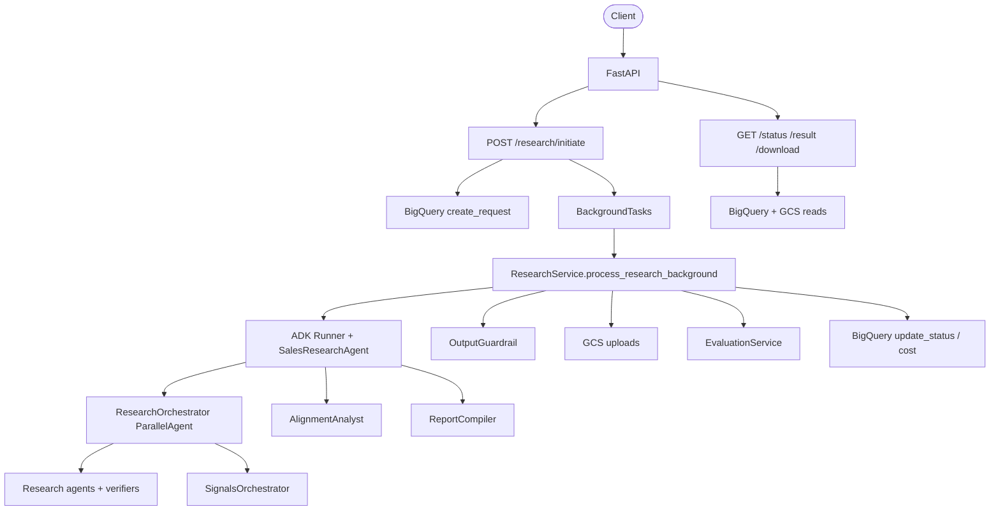
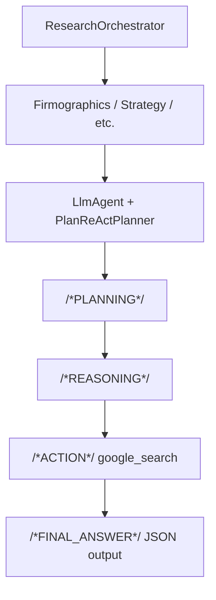

# Sales-Agent Optimization Plan

**Date:** 2026-05-18  
**Version:** 1.1  
**Scope:** Focused optimization (excludes items marked *no action* by product decision)  
**Goal:** Improve latency, data correctness, and operability for the remaining gaps.

---

## Scope decisions (v1.1)

The following gaps are **explicitly out of scope** — no optimization work planned:

| Gap | Topic | Rationale |
|-----|--------|-----------|
| **G1** | In-process `BackgroundTasks` | Accepted as-is |
| **G5** | Random 1–5s agent stagger | Accepted as-is |
| **G7** | Full pipeline retry on output guardrail failure | Accepted as-is |
| **G8** | Post-run evaluation cost/latency | Accepted as-is |
| **G9** | Hallucination LLM check in output guardrail | Accepted as-is |
| **G13** | Single model (`gemini-2.5-pro`) for all agents | Accepted as-is |
| **G14** | Large / repeated prompts | Accepted as-is |
| **G15** | `google_search` on global + per-agent config | Accepted as-is |
| **G19** | `/auth/token` domain-only JWT | Accepted as-is |
| **G22** | `rouge_score` dependency declaration | Accepted as-is |

**G6 is in scope** with a **different approach**: replace per-step verifier agents with Google ADK **`PlanReActPlanner`** (plan → reason → act loop), not verifier reduction alone.

**Revised priority order:** baseline → quick wins (BQ/logging/clients) → data layer → **G6 planner refactor** → catalog RAG → security (G18/G20) → tests.

---

## Executive summary

After scope trimming, the highest-impact remaining work is:

| Area | Primary issue | Expected impact |
|------|---------------|-----------------|
| BigQuery | Per-event status writes during parallel agent runs | Large p95 latency reduction |
| Observability | Telemetry BQ methods are stubs | Per-agent tuning in dashboards |
| Data correctness | Metadata overwrite, nested GCS repo | Fewer lost fields / cleaner DI |
| Research orchestration (G6) | Verifier agent per research step | Cleaner flow via `PlanReActPlanner` |
| Catalog tool | Vector search returns IDs only | Better alignment quality |

Items removed from this plan (background jobs, model tiering, prompt compression, eval/guardrail cost cuts, auth token hardening, rouge dep) are documented above as **no action**.

---

## Current architecture (as implemented)



**Target architecture for G6 (planned):**



**Key files**

| Layer | Path |
|-------|------|
| App bootstrap | `src/routes/app.py` |
| Research API | `src/routes/research.py` |
| Orchestration | `src/services/research/research_service.py` |
| Agent graph | `src/agents/salesAgent/agent.py` |
| Research agents | `src/agents/salesAgent/sub_agents/research_agents.py` |
| Verifiers (to replace) | `src/agents/salesAgent/sub_agents/verifier_agents.py` |
| Agent factory | `src/agents/salesAgent/utils/agent_factory.py` |
| BigQuery | `src/repositories/bigquery_repository.py` |
| GCS | `src/repositories/gcs_repository.py` |
| Callbacks | `src/utils/callbacks.py` |
| Config | `src/core/config.py` |

---

## Gap analysis

### In scope — action required

#### P0 — Reliability & performance

| # | Gap | Evidence | Planned action |
|---|-----|----------|----------------|
| G2 | Startup swallows BQ/GCS init failures | `src/routes/app.py` lifespan | Fail fast or explicit health flag |
| G3 | Duplicate GCP client factories | `clients.py` vs `service_dependencies.py` | Single pool |
| G4 | BQ `update_status` on every ADK event | `_process_event_milestones` | Debounce / milestone-only writes |

#### P0 — Research orchestration (G6)

| # | Gap | Current | Planned action |
|---|-----|---------|----------------|
| **G6** | Verifier after each research step | `SequentialAgent` + `create_verifier_agent()` per lane | Use ADK **`PlanReActPlanner`** on research `LlmAgent`s; remove inline verifier sub-agents where planner covers plan→search→validate loop |

**ADK reference (installed in `.venv`):**

```python
from google.adk.planners import PlanReActPlanner

# On LlmAgent (via agent_factory):
agent = LlmAgent(
    ...,
    planner=PlanReActPlanner(),
    tools=[google_search],
)
```

`PlanReActPlanner` drives tagged phases: `/*PLANNING*/`, `/*REPLANNING*/`, `/*REASONING*/`, `/*ACTION*/`, `/*FINAL_ANSWER*/` (see `google.adk.planners.plan_re_act_planner`).

**Implementation notes for G6:**

1. Extend `create_llm_agent()` to accept optional `planner: BasePlanner | None`.
2. Apply `PlanReActPlanner()` to research agents (firmographics, geographic, strategy, etc.) — not necessarily to `ReportCompiler` (structured markdown output).
3. Remove verifier steps from `firmographics_geographic_agent`, `strategy_compliance_agent`, `market_ecosystem_agent`, `tech_stack_pipeline`, `executive_pipeline` sequential graphs.
4. Keep `raw_search_cache_*` population via existing `after_tool_callback` / grounding hooks.
5. **`before_model_callback`:** append guardrail/jailbreak instructions; do **not** replace full system prompt (known ADK issue #3946 with planner instructions).
6. Validate on golden companies: compare report quality vs verifier pipeline before full cutover.

#### P1 — Data correctness

| # | Gap | Evidence | Planned action |
|---|-----|----------|----------------|
| G10 | `metadata_update` replaces JSON | `BigQueryRepository.update_status` | JSON merge in SQL or app layer |
| G11 | Telemetry table + batch insert no-ops | `bigquery_repository.py` | Implement schema + `insert_rows_json` |
| G12 | `get_request_result` creates `GCSRepository()` | `bigquery_repository.py` | Inject from service layer |

#### P1 — Product / RAG

| # | Gap | Evidence | Planned action |
|---|-----|----------|----------------|
| G16 | Context cache vs per-run agent recreation | `create_sales_agent_app()` each retry | Document behavior; optional app reuse on retry (low priority) |
| G17 | Vector search returns IDs only | `product_catalog_tool.py` | Resolve neighbor IDs to chunk text |

#### P1 — Security (partial)

| # | Gap | Evidence | Planned action |
|---|-----|----------|----------------|
| G18 | Default `SECRET_KEY` in config | `src/core/config.py` | Fail startup when default secret in non-DEBUG |
| G20 | `AUTH_ENABLED` / IAP unused in deps | `config.py` vs `dependencies/auth.py` | Align IAP/JWT deps with config flags |

#### P2 — Dependencies & tests

| # | Gap | Evidence | Planned action |
|---|-----|----------|----------------|
| G21 | `pydantic_settings` not in direct deps | `pyproject.toml` | Add explicit dependency |
| G23 | Stale tests vs `ResearchService` API | `test_research_service_v2.py` | Update mocks and method names |
| G24 | README `/ingest` vs `/initiate` | `README.md` | Doc sync |

### Out of scope — no optimization

| # | Gap | Status |
|---|-----|--------|
| G1 | BackgroundTasks durability | **No action** |
| G5 | Random stagger in `before_agent_callback` | **No action** |
| G7 | Output guardrail full-pipeline retry | **No action** |
| G8 | Post-run evaluation always on | **No action** |
| G9 | Hallucination Flash call in guardrail | **No action** |
| G13 | Model tiering | **No action** |
| G14 | Prompt compression | **No action** |
| G15 | Redundant google_search config | **No action** |
| G19 | `/auth/token` flow | **No action** |
| G22 | `rouge_score` in pyproject | **No action** |

### ADK package behavior (relevant to in-scope work)

- **`ParallelAgent`** — each branch event blocks until the runner consumes it; debouncing BQ writes (G4) directly helps parallel research (G4 in scope; G5 stagger out of scope).
- **`PlanReActPlanner`** — structured plan/reason/act without separate verifier `LlmAgent` instances (G6).
- **`ContextCacheConfig`** — already on `App`; optional follow-up under G16 only.
- **`ReflectAndRetryToolPlugin`** — keep; tool retry is separate from G6.

---

## Optimization strategy

### Design principles (revised)

1. **Measure before optimizing** — baseline p50/p95, BQ queries/job, tokens/job.
2. **Batch and debounce writes** — BigQuery during agent streaming (G4).
3. **Use ADK primitives** — `PlanReActPlanner` for research reasoning loop instead of custom verifier agents (G6).
4. **Fix data layer first** — telemetry and metadata before large agent refactors.
5. **Respect scope** — do not implement excluded items unless product reopens them.

---

## Phased roadmap

### Phase 0 — Baseline & instrumentation (1–2 days)

**Objective:** Metrics for in-scope improvements only.

| Task | Acceptance criteria |
|------|---------------------|
| Job timing spans: accept → complete, research, upload | Cloud Trace |
| Counters: `bq_writes_per_job`, `llm_calls_per_job` | Structured logs |
| Load profile: 10 / 25 / 50 concurrent initiations | `docs/perf-baseline.md` |
| Golden job trace (success + failure) | Linked from runbook |

---

### Phase 1 — Quick wins (2–4 days)

**Objective:** Latency and BQ load without changing job or agent models.

#### 1.1 Debounce BigQuery progress updates (G4)

- Only `update_status` when `(progress, current_step)` changes or ≥ 5s since last write.
- Remove per-event writes in `_process_event_milestones` except configured milestones.
- **Files:** `src/services/research/research_service.py`
- **Acceptance:** BQ writes per job ↓ ≥ 80%.

#### 1.2 Reduce callback log volume

- Do not log full `tool_response` at INFO; log tool name, query summary, entry count.
- **Files:** `src/utils/callbacks.py`

#### 1.3 Cache embedding model (G17 prep)

- Lazy singleton `TextEmbeddingModel` in `product_catalog_tool.py`.

#### 1.4 Unify GCP client pool (G3)

- Route `service_dependencies` through `client_pool` only.
- **Files:** `src/dependencies/service_dependencies.py`, `src/core/clients.py`

#### ~~1.2 Replace random stagger~~ — **Removed (G5 out of scope)**

---

### Phase 2 — Data layer & observability (3–5 days)

#### 2.1 Agent telemetry in BigQuery (G11)

- Implement `ensure_agent_telemetry_table_exists` + `insert_agent_telemetry_batch`.
- Schema aligned with `AgentTelemetryRecord` in `src/utils/telemetry.py`.

#### 2.2 Metadata merge (G10)

- Merge `metadata_update` into existing JSON (BigQuery `JSON_SET` or read-merge-write).

#### 2.3 Job state vs history tables (optional)

- `research_requests_current` + append-only `research_requests_events` for audit without hot UPDATE churn.

#### 2.4 Schema creation off startup (G2)

- Move `ensure_*_exists` to migration/CI; startup fails clearly if tables missing.

#### 2.5 Inject GCS in `get_request_result` (G12)

- Pass `GCSRepository` from `ResearchService`; no `GCSRepository()` inside BQ repo.

---

### Phase 3 — G6: PlanReAct planner refactor (5–8 days)

**Objective:** Replace per-step verifier agents with ADK `PlanReActPlanner` on research agents.

#### 3.1 Factory and config

- Add `planner` parameter to `create_llm_agent()`.
- Config flag: `USE_PLAN_REACT_PLANNER=true` (default false until validated).

#### 3.2 Research agent migration

| Current pipeline | Change |
|------------------|--------|
| `FirmographicsAgent` → verifier → `GeographicAgent` → verifier | Two `LlmAgent`s with `PlanReActPlanner`, or one combined agent if prompts allow |
| `StrategyAgent` → verifier → `ComplianceAgent` → verifier | Same pattern |
| `MarketAgent` → verifier → … → `ProcurementAgent` | Same pattern |
| `TechStackAgent` → verifier | Single planner-enabled agent |
| `ExecutiveAgent` → verifier | Single planner-enabled agent |

- Delete or deprecate `verifier_agents.py` usage from `research_agents.py` once parity tests pass.

#### 3.3 Callback compatibility

- Audit `before_model_callback`: **append** instructions when planner is active.
- Ensure `after_tool_callback` still fills `raw_search_cache_*` for guardrails/eval (out of scope for cost, still used).

#### 3.4 Validation

- Side-by-side run: 5–10 companies, verifier pipeline vs planner pipeline.
- Compare: section completeness, grounding URLs, evaluation score (if you still run eval).
- Rollout: feature flag per environment.

**Acceptance:** Verifier sub-agents removed from research sequential graphs; quality within agreed threshold; no regression in quota error rate vs baseline.

---

### Phase 4 — Catalog RAG & hygiene (2–4 days)

#### 4.1 Product catalog text resolution (G17)

- Map vector neighbor IDs to stored chunk text (GCS/Firestore/BQ).
- **Files:** `src/tools/product_catalog_tool.py`

#### 4.2 Security (G18, G20 only)

- Fail startup if default `SECRET_KEY` in production.
- Wire `AUTH_ENABLED` / IAP audience into route dependencies where applicable.
- **Not in scope:** G19 `/auth/token` redesign.

#### 4.3 Dependencies & docs

- Add `pydantic-settings` to `pyproject.toml` (G21).
- Sync README endpoints (`/initiate`) (G24).
- **Not in scope:** G22 `rouge-score`.

---

### Phase 5 — Tests & CI (2–3 days)

| Task | Maps to |
|------|---------|
| Fix `test_research_service_v2.py` | G23 |
| Contract tests: metadata merge, telemetry insert, debounced status | G10, G11, G4 |
| Planner integration test (mocked ADK run) | G6 |
| BQ write budget regression test | G4 |

**Acceptance:** CI green; perf test fails if status writes regress.

---

## Removed phases (from v1.0)

The following phases were **dropped** per scope decision:

| Former phase | Reason |
|--------------|--------|
| Phase 3 — Durable job execution (queue/workers) | G1 out of scope |
| Phase 4 — Model routing, prompt compression, guardrail retry, eval modes | G7, G8, G9, G13, G14 out of scope |
| Phase 5 — Auth token / rouge dependency | G19, G22 out of scope |
| Epic E3 — Durable jobs | Removed |
| Epic E4 (partial) — Model routing, prompts, guardrail retry, eval toggle | Removed |

---

## Sprint-ready backlog (revised epics)

### Epic E1 — Performance quick wins
- [ ] E1-1 Debounce BQ status updates (G4)
- [ ] E1-2 Trim callback logging
- [ ] E1-3 Unify client pool (G3)
- [ ] E1-4 Cache embedding model

**Estimate:** 5 points | **Priority:** P0

### Epic E2 — Data & telemetry
- [ ] E2-1 Telemetry BQ table + batch insert (G11)
- [ ] E2-2 Metadata JSON merge (G10)
- [ ] E2-3 Optional current + events tables
- [ ] E2-4 Migration script; startup hardening (G2)
- [ ] E2-5 Inject GCS in get_request_result (G12)

**Estimate:** 8 points | **Priority:** P0

### Epic E3 — PlanReAct planner (G6)
- [ ] E3-1 `planner` support in `agent_factory`
- [ ] E3-2 Migrate research sequential pipelines
- [ ] E3-3 Remove verifier sub-agents
- [ ] E3-4 Callback + cache compatibility
- [ ] E3-5 Side-by-side quality validation + feature flag

**Estimate:** 13 points | **Priority:** P0

### Epic E4 — Catalog & security (partial)
- [ ] E4-1 Catalog chunk text resolution (G17)
- [ ] E4-2 SECRET_KEY startup guard (G18)
- [ ] E4-3 AUTH_ENABLED / IAP alignment (G20)
- [ ] E4-4 `pydantic-settings` + README sync (G21, G24)

**Estimate:** 5 points | **Priority:** P1

### Epic E5 — Quality gates
- [ ] E5-1 Fix stale unit tests (G23)
- [ ] E5-2 BQ write budget test (G4)
- [ ] E5-3 Baseline doc + quarterly review

**Estimate:** 5 points | **Priority:** P2

---

## Success metrics (in-scope targets)

| Metric | Baseline (Phase 0) | Target |
|--------|-------------------|--------|
| p95 time-to-complete (job) | TBD | −20% after Phase 1 |
| BigQuery queries/DML per job | TBD | ≤ 15 |
| BQ writes during research phase | TBD | −80% (debounce) |
| Verifier LLM calls per job | TBD | −N calls (G6: verifiers removed) |
| Telemetry rows per job | 0 today | 1 row per tracked leaf agent |
| Alignment section quality (manual) | TBD | No regression after G17 |

*Token/cost reduction targets from v1.0 removed (G8, G13, G14 not in scope).*

---

## Risks & mitigations

| Risk | Mitigation |
|------|------------|
| `PlanReActPlanner` skips tool calls (known ADK issues) | Golden tests; keep `ReflectAndRetryToolPlugin`; monitor tool call metrics |
| Planner overwrites instructions in `before_model_callback` | Append-only instruction updates |
| Debounced status feels less live | Milestone map unchanged; 5s heartbeat optional |
| Metadata merge bugs | Contract tests + backfill script |

---

## Out of scope (summary)

- G1, G5, G7, G8, G9, G13, G14, G15, G19, G22 — **no optimization**
- UI/Streamlit unless required for status UX
- Full agent topology rewrite beyond G6 planner migration
- Replacing BigQuery

---

## References

- ADK planners: `google.adk.planners.PlanReActPlanner` (`.venv`)
- Telemetry runbook: `docs/telemetry-runbook.md`
- Container security: `docs/container-security.md`

---

## Revision history

| Version | Date | Notes |
|---------|------|-------|
| 1.0 | 2026-05-18 | Initial plan from codebase deep review |
| 1.1 | 2026-05-18 | Scoped out G1,G5,G7–G9,G13–G15,G19,G22; G6 → PlanReActPlanner; trimmed phases/epics |
