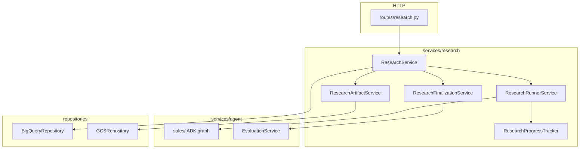
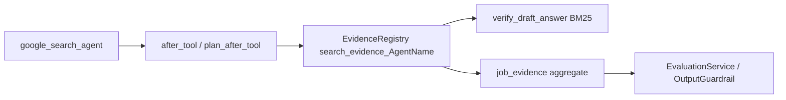

# Research job architecture

This document describes how company research jobs flow through the API, services, ADK agents, and persistence layers.

For catalog vector indexing, see [catalog-vector-index.md](catalog-vector-index.md).

## Layered structure

| Layer | Path | Role |
|-------|------|------|
| Routes | `src/routes/research.py` | Routing, OpenAPI, DI only |
| Handlers | `src/handlers/research_handler.py` | Guardrails, trace propagation, response mapping |
| Orchestrator | `src/services/research/research_service.py` | Job lifecycle, validation gate, coordinates sub-services |
| Runner | `src/services/research/runner_service.py` | ADK `Runner`, per-agent retries, event milestones |
| Artifacts | `src/services/research/artifact_service.py` | GCS uploads |
| Finalization | `src/services/research/finalization_service.py` | PDF, evaluation, cost, telemetry |
| Agent graph | `src/services/agent/sales/` | ADK prompts, sub-agents, sales-specific utils |
| Agent runtime | `src/services/agent/utils/` | Callbacks, pipeline, telemetry, safety |
| Repositories | `src/repositories/` | BigQuery and GCS I/O |

Domain logic lives in `services/`; handlers bridge HTTP to services without embedding business rules in routes.

## API endpoints

Base path: `/api/v1/research`

| Method | Path | Description |
|--------|------|-------------|
| `POST` | `/initiate` | Create job, enqueue background research (202) |
| `GET` | `/status/{job_id}` | Poll progress |
| `GET` | `/result/{job_id}` | Completed report + model card |
| `GET` | `/download/{job_id}` | PDF attachment |

## Background job flow

1. **Initiate** — Route validates `company_name`, service generates `job_id`, writes `QUEUED` row to BigQuery.
2. **Process** — `ResearchService.process_research_background` runs asynchronously:
   - `ResearchRunnerService.run` executes the ADK graph
   - Report validation gate (`report_validation_status` must be `PASSED`)
   - `ResearchArtifactService` uploads markdown + session JSON to GCS
   - `ResearchFinalizationService` generates PDF, runs evaluation, writes cost/telemetry
   - Job marked `COMPLETED` or `FAILED`
3. **Poll** — Client uses `/status` until `COMPLETED`, then `/result` or `/download`.

## Tracing

OpenTelemetry spans use `@traced` and `@traced_with_context` from `src/utils/tracing.py`:

| Span | Where |
|------|--------|
| `research.request.accepted` | Route (HTTP accept) |
| `research.background.process` | `ResearchService.process_research_background` |
| `research.adk.run` | `ResearchRunnerService.run` |
| `research.adk.runner.lifecycle` | `ResearchRunnerService.run_agents` |
| `research.artifacts.upload` | `ResearchArtifactService.upload_artifacts` |
| `research.finalize` | `ResearchFinalizationService.finalize` |

ADK/GenAI auto-instrumentation and callback `add_event` calls remain separate. Per-agent cost rows in session state are flushed via `src/utils/telemetry.py`, not OTel spans.

## Configuration

Key settings in `src/core/config.py`: `JOB_ID_PREFIX`, `RESEARCH_*_PROGRESS` labels, `AGENT_RETRY_ATTEMPTS`, `GEMINI_MODEL`, BigQuery table names.

## Evidence flow (v2)

- Per-agent keys: `search_evidence_{AgentName}` via `src/services/research/agent/sales/utils/evidence.py`
- Post-run: `session_state["job_evidence"] = aggregate_job_evidence(session_state)`
- BM25 uses scoped evidence only; verify FAILED triggers in-loop replan (no runner retry)
- ADK `App.events_compaction_config` compacts session event history (token threshold + sliding window)

## Evaluation v2

| Section | Weight | Content |
|---------|--------|---------|
| A | 80% | LLM judge D1–D14 + M12/M13 penalties; `format_agent_outputs_for_judge` |
| B | 20% | M1 agent coverage, M2 completeness, M3 citation groundedness, M4 evidence breadth, M5 semantic (ONNX, optional) |

`evaluation_metadata.scoring_version` is `v2`. ROUGE removed. Set `EVAL_EMBEDDING_ENABLED=false` in CI when ONNX model is not bundled (~80–150MB for MiniLM).

## Related code

| Area | Path |
|------|------|
| DI wiring | `src/dependencies/service_dependencies.py` |
| Agent pipeline retries | `src/services/agent/utils/agent_pipeline.py` |
| Evidence registry | `src/services/research/agent/sales/utils/evidence.py` |
| Guardrails | `src/utils/guardrails.py` |
| Tests | `tests/services/test_research*.py`, `tests/services/research/` |
