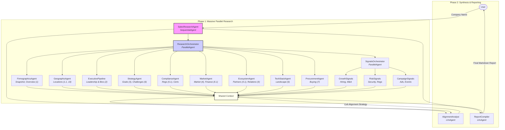

# Sales Research Agent Architecture

The following diagram illustrates the proposed architecture for the Sales Research Agent.

## Agent Roles (Scraping Categories)

1.  **SalesResearchAgent**: The main host.
2.  **Specialized Scopes**: Each agent maps exactly to 1-2 derived sections of your template.
3.  **Logical Grouping**:
    *   **FirmographicsAgent**: Snapshot, Overview (1).
    *   **GeographicAgent**: Global Ops (1.1), Regional Spend (10).
    *   **ExecutivePipeline**: Leaders + Bios (2).
    *   **StrategyAgent**: Priorities (3), Challenges (6).
    *   **ComplianceAgent**: Regulations (5.1).
    *   **MarketAgent**: Market Position (4), Financial Relevance (6.1).
    *   **EcosystemAgent**: Partners (4.1), Relationships (9).
    *   **TechStackAgent**: Tech Landscape (5).
    *   **ProcurementAgent**: Procurement (7).
    *   **SignalsOrchestrator**: Parent agent managing the Signals category (13).
        *   `GrowthSignals`: Hiring, M&A.
        *   `RiskSignals`: Security, Regulations.
        *   `CampaignSignals`: Campaigns, Ads.
4.  **AlignmentAnalyst**: Generates "8. Colt Technology Alignment" and "11. Strategic Opportunity Summary".
5.  **ReportCompiler**: Assembles Sections 1-13 + Source Summary into the final report.

## Optimization Analysis

**The "Flat Parallel" Architecture**:
1.  **Massive Parallelism**: All 12 specialized agents start immediately. We don't wait for a "Strategy Manager" to call a "Compliance Worker".
2.  **Tool-Level Caching**: We rely on shared tools to prevent duplicate work. If `StrategyAgent` and `FirmographicsAgent` both request the same URL, the second request is served from the cache, enabling efficiency without sacrificing the quality benefits of specialized agents.
3.  **Cost Efficiency**: We removed intermediate "management" agents, paying only for the actual research work.
