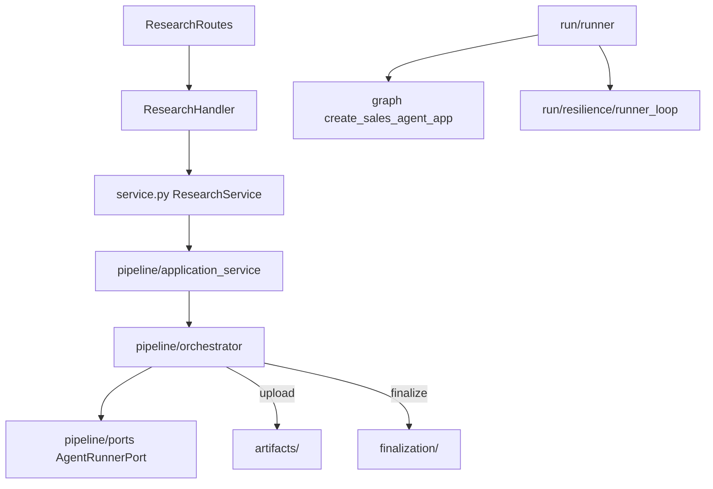
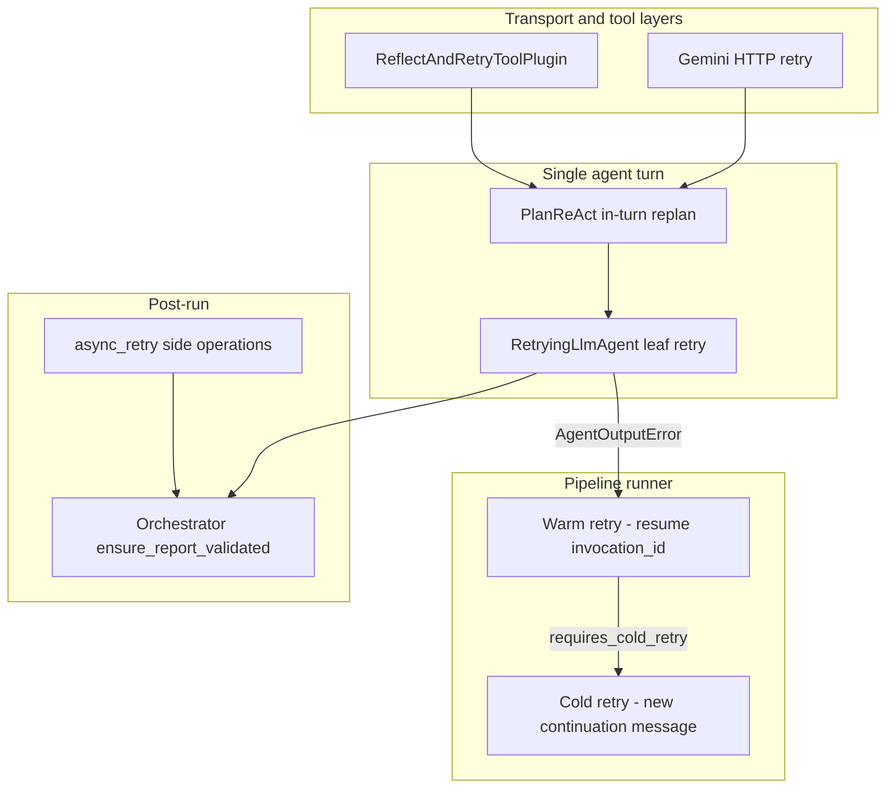

# Research Services

Research services handle background sales-intelligence jobs from API request through ADK execution, artifact persistence, and finalization.

## Request Flow



## Package Layout (entry-point order)

| Path | Responsibility |
|------|----------------|
| [`service.py`](service.py) | Public API facade for handlers |
| [`pipeline/`](pipeline/) | Background job orchestration, ports, adapters |
| [`run/`](run/) | ADK Runner execution, sessions, telemetry, runner retry |
| [`agents/`](graph/) | ADK App build: `sales/composition/`, `sales/tools/`, `adk/` callbacks |
| [`artifacts/`](artifacts/) | GCS uploads |
| [`finalization/`](finalization/) | PDF, evaluation, telemetry flush |
| [`domain/`](domain/) | Contracts, models, output validation |
| [`utils/`](utils/) | Metrics, status helpers, async IO retry |

## Navigation

| Debugging… | Start here |
|------------|------------|
| HTTP / handler | `service.py` |
| Job stuck PROCESSING | `pipeline/orchestrator.py` |
| Runner / session / cold retry | `run/runner.py` → `run/resilience/runner_loop.py` |
| Agent graph / callbacks | `agents/sales/composition/` → `agents/adk/` |
| GCS / PDF / evaluation | `artifacts/`, `finalization/` |
| Output keys | `domain/agent_contracts.py` |
| Retry behavior / which agent retried | This section → `run/resilience/errors.py` |

## Imports

- Public: `from src.services.research import ResearchService`
- Graph app: `from src.services.research.agents import create_sales_agent_app`
- Runner: `from src.services.research.run import ResearchRunnerService`

## Retry Architecture

Research jobs pass through several independent retry layers. Each layer handles a different failure mode; they do not replace one another.



### Retry layers overview

| Layer | Where | Module | Scope |
|-------|-------|--------|-------|
| HTTP / Gemini transport | Model client | `core/model.py` | Transient API errors (429, 5xx) via `HttpRetryOptions` |
| ADK tool reflect-and-retry | App plugin | `agents/sales/composition/app.py` | Tool invocation failures (`ReflectAndRetryToolPlugin`, max 3) |
| PlanReAct in-turn | Single agent turn | prompts + `agents/sales/callbacks/plan_react.py` | `verify_draft_answer` / `validate_final_report` returned FAILED → model replans in same turn |
| **Leaf retry** | Inside each `RetryingLlmAgent` | `agents/adk/retrying_llm_agent.py` | Transient exceptions during model run; empty `output_key` before `after_agent` raises |
| **Warm retry** | Pipeline runner loop | `run/resilience/runner_loop.py` | Resume same ADK `invocation_id`; reset and re-run failed agent(s) only |
| **Cold retry** | Pipeline runner loop | `run/resilience/runner_loop.py` | New user continuation message; no invocation resume |
| Side-op retry | Finalization / GCS | `utils/async_retry.py` | PDF upload, evaluation, telemetry flush |
| Orchestrator fallback | Post-run gate | `pipeline/orchestrator.py` + `agents/sales/tools/report_validation.py` | Report guardrails if tool skipped (defense in depth; limited when status already FAILED) |

### Leaf vs warm vs cold

These are the three retry mechanisms most relevant when debugging agent failures.

#### Leaf retry

**Module:** `agents/adk/retrying_llm_agent.py` (`RetryingLlmAgent._run_async_impl`)

Every tracked leaf agent is wrapped in `RetryingLlmAgent` (see `agents/sales/composition/leaf.py`). On failure it:

1. Resets ADK agent state (`ctx.set_agent_state(...)`)
2. Clears the agent's `output_key` via `prepare_agent_retry` in `run/resilience/state.py`
3. Stores a one-shot hint in `agent_retry_hints` (injected on the next model call via `before_model_callback`)
4. Sleeps `AGENT_RETRY_WAIT_FIXED` seconds
5. Re-runs **only that agent** inside the same pipeline step

Leaf retry triggers on:

- **Transient exceptions** during the model run (connection errors, model errors, etc.)
- **Empty output** when the run completes without raising but `output_key` was never populated

Leaf retry does **not** trigger on:

- Any `AgentOutputError` (including `MISSING_OUTPUT` and `REPORT_VALIDATION_FAILED`) — these propagate immediately to the pipeline layer
- Input guardrail blocks, safety blocks, or prompt-injection blocks

#### Warm retry

**Module:** `run/resilience/runner_loop.py` (`run_runner_with_per_agent_retry` → `_handle_agent_failure_retry`)

When `after_agent_callback` raises `AgentOutputError`, the runner loop calls `apply_retry` in `run/resilience/state.py`. If approved:

1. Increments `agent_retry_counts[agent_name]`
2. Clears failed agent output(s) via `prepare_agents_retry`
3. Appends ADK agent reset events via `run/resilience/adk_resume.py`
4. **Resumes the same `invocation_id`** so upstream completed agents are not re-run
5. Updates BigQuery status via the runner's `_on_retry` handler

Warm retry is the default for most contract failures (`MISSING_OUTPUT`, `MALFORMED_FUNCTION_CALL`, `CONNECT_ERROR`, `RESOURCE_EXHAUSTED`, `AGENT_ERROR`, `MODEL_ERROR`).

#### Cold retry

**Module:** `run/resilience/runner_loop.py` + `run/state_mutation.py` (`requires_cold_retry`)

Cold retry starts a **new runner iteration** with a fresh user continuation message (`build_retry_continuation_message`) instead of resuming `invocation_id`.

Triggered today when:

- The exception message contains `"contents are required"` (ADK cannot resume the invocation)

`RETRY_SCOPE_RUNNER_COLD` is defined in `run/resilience/errors.py` but is **not currently mapped** to any `error_class`; no `AgentOutputError` routes to cold retry via error class alone.

### Error class → retry scope

Classification lives in `run/resilience/errors.py`. Retry budget is shared via `AGENT_RETRY_ATTEMPTS` (default 3 → initial attempt plus 2 retries).

| `error_class` | Scope | Leaf (`RetryingLlmAgent`) | Pipeline (`apply_retry`) |
|---------------|-------|---------------------------|--------------------------|
| `MISSING_OUTPUT` | `LEAF_LOCAL` | No — raises `AgentOutputError` | Yes — warm resume |
| `MALFORMED_FUNCTION_CALL` | `LEAF_LOCAL` | No | Yes — warm resume |
| `CONNECT_ERROR` | `LEAF_LOCAL` | Yes — transient exception | Yes — warm resume |
| `RESOURCE_EXHAUSTED` | `RUNNER_WARM` | Yes — transient exception | Yes — warm resume |
| `AGENT_ERROR` / `MODEL_ERROR` | `RUNNER_WARM` | Yes — transient exception | Yes — warm resume |
| `REPORT_VALIDATION_FAILED` | `NO_RETRY` | No | **No — job fails** |

`REPORT_VALIDATION_FAILED` is terminal: the runner catches it, returns an empty report string, and the orchestrator marks the job `FAILED`.

### Tracked agents and retry behavior

Output contracts are defined in `domain/agent_contracts.py`. Only agents with an `output_key` participate in contract validation and retry bookkeeping.

#### Research leaves (parallel via `ResearchOrchestrator`)

| Agent | Output key |
|-------|------------|
| FirmographicsAgent | `firmographicsagent_output` |
| GeographicAgent | `geographicagent_output` |
| ExecutiveAgent | `executiveagent_output` |
| StrategyAgent | `strategyagent_output` |
| ComplianceAgent | `complianceagent_output` |
| MarketAgent | `marketagent_output` |
| EcosystemAgent | `ecosystemagent_output` |
| TechStackAgent | `techstackagent_output` |
| ProcurementAgent | `procurementagent_output` |
| GrowthSignals | `growthsignals_output` |
| RiskSignals | `risksignals_output` |
| CampaignSignals | `campaignsignals_output` |

#### Synthesis (sequential after research)

| Agent | Output key |
|-------|------------|
| AlignmentAnalyst | `alignment_output` |
| ReportCompiler | `final_report` |

#### Composite orchestrators (not tracked)

These agents coordinate sub-agents but have no `output_key` and no contract validation. Failures surface on **leaf** agent names:

- `SalesResearchAgent` (root sequential pipeline)
- `ResearchOrchestrator` (parallel research phase)
- `FirmographicsGeographicAgent`, `StrategyComplianceAgent`, `MarketEcosystemAgent` (sequential lane wrappers)
- `SignalsOrchestrator` (parallel signals)

#### Special cases

- **AlignmentAnalyst blocked by missing research:** `resolve_retry_agents` in `run/resilience/errors.py` retries only the missing upstream research agents, not all parallel lanes.
- **ReportCompiler retry prep:** `prepare_agent_retry` also clears `report_validation_status` and `report_validation_violations`.
- **ReportCompiler validation failure:** no leaf, pipeline, or warm retry; runner returns `""`; orchestrator marks job `FAILED`.

### PlanReAct in-turn retry (within a single agent turn)

Research and synthesis agents use `PlanReActPlanner`. Within one agent invocation the model can replan without triggering pipeline retry:

| Tool | Agent(s) | On FAILED |
|------|----------|-----------|
| `verify_draft_answer` | Research leaves | Model should `/*REPLANNING*/`, revise draft, call tool again, then emit `/*FINAL_ANSWER*/` after PASSED |
| `validate_final_report` | ReportCompiler | Model should replan and call tool again (up to `OUTPUT_GUARDRAIL_MAX_RETRIES + 1` attempts before terminal failure) |

`plan_before_model` in `agents/sales/callbacks/plan_react.py` injects steering hints when verification or validation previously failed.

### End-to-end retry flow

```mermaid
sequenceDiagram
    participant Agent as RetryingLlmAgent
    participant CB as after_agent callback
    participant Loop as runner_loop
    participant Resume as adk_resume

    Agent->>Agent: Model run (leaf retry on transient exc)
    Agent->>CB: Agent completes
    CB->>CB: validate_agent_output
    alt validation passed
        CB-->>Loop: Success
    else AgentOutputError
        CB-->>Loop: Raise error
        Loop->>Loop: apply_retry
        alt RETRY_SCOPE_NONE
            Loop-->>Loop: Job fails (e.g. REPORT_VALIDATION_FAILED)
        else warm retry approved
            Loop->>Resume: append_agent_reset_events
            Loop->>Loop: Resume invocation_id
            Loop->>Agent: Re-run failed agent only
        else cold retry required
            Loop->>Loop: build_retry_continuation_message
            Loop->>Agent: New runner iteration
        end
    end
```

### Configuration

| Setting | Default (`.env`) | Purpose |
|---------|------------------|---------|
| `AGENT_RETRY_ATTEMPTS` | 3 | Max attempts for leaf + pipeline retry (initial + retries) |
| `AGENT_RETRY_WAIT_FIXED` | 2 | Seconds to sleep between leaf retries |
| `GEMINI_RETRY_ATTEMPTS` | (see `.env`) | HTTP transport retry count on Gemini client |
| `GEMINI_RETRY_INITIAL_DELAY` | (see `.env`) | Initial backoff for HTTP retries |
| `GEMINI_RETRY_MAX_DELAY` | (see `.env`) | Max backoff for HTTP retries |
| `OUTPUT_GUARDRAIL_MAX_RETRIES` | (see `.env`) | In-turn `validate_final_report` attempts before terminal failure |
| `ReflectAndRetryToolPlugin(max_retries=3)` | hardcoded in `app.py` | ADK tool-call retries |

### Session state keys for debugging

| Key | Set by | Meaning |
|-----|--------|---------|
| `agent_retry_counts` | `run/resilience/state.py` | Per-agent retry attempt counter |
| `agent_retry_hints` | `run/resilience/state.py` | One-shot hint injected on next model call |
| `pipeline_retry_agent` | `run/resilience/state.py` | Agent currently being retried at pipeline level |
| `report_validation_status` | `report_validation.py`, callbacks | `PASSED` / `FAILED` / unset |
| `report_validation_violations` | `report_validation.py`, callbacks | List of guardrail violations |
| `report_validation_attempts` | `validate_final_report` tool | In-turn validation attempt count |
| `report_validation_tool_call_count` | `plan_after_tool` callback | How many times model called the tool |
| `report_compiler_seen_planreact_phases` | `plan_after_model` callback | PlanReAct tags observed during compile |

Log prefix to grep: `[Retry]`
