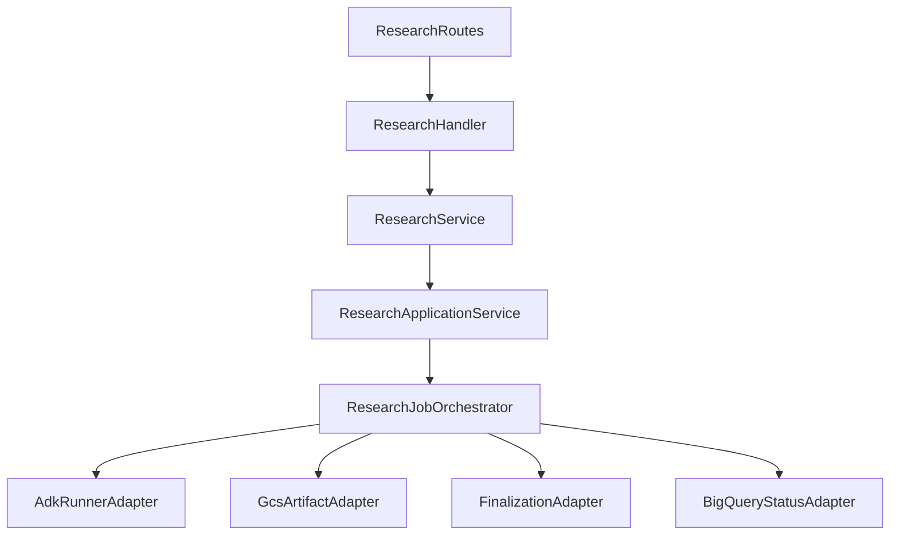

# Research Services

Research services handle background sales-intelligence jobs from API request through ADK execution, artifact persistence, and finalization.

## Request Flow

## Package Layout

| Path | Responsibility |
|------|----------------|
| `research_service.py` | Public API-facing service used by handlers |
| `application/` | Pipeline orchestration (`commands`, `orchestrator`, application service facade) |
| `infrastructure/` | Port protocols and adapters for runner, artifacts, finalization, status repository |
| `runner_service.py` | ADK runner lifecycle and event streaming |
| `progress.py` | Debounced BigQuery progress and agent guardrails on events |
| `artifact_service.py` | GCS uploads (report, session, per-agent outputs) |
| `finalization_service.py` | PDF generation, evaluation, cost attribution, telemetry flush |
| `metrics.py` | Model card metrics and cost reconciliation |
| `agent/` | ADK graph, callbacks, retry pipeline, prompt packages, evaluation |

## Key Design Decisions

- `ResearchService` remains a stable compatibility entrypoint for routes and handlers.
- Pipeline logic lives in `ResearchJobOrchestrator` so status, retry, artifact, and finalization stages are explicit.
- Infrastructure details are isolated behind adapters/ports for cleaner testing and future backend swaps.
- Tracing still uses `@traced` and `@traced_with_context` from `src/utils/tracing.py` with `research.*` span names.
