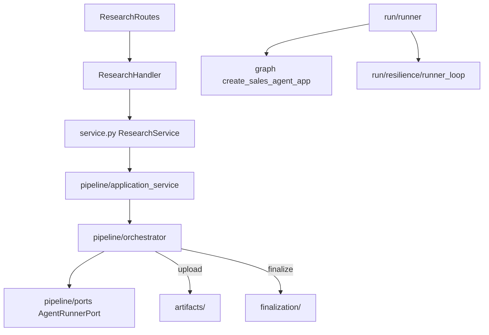

# Research Services

Research services handle background sales-intelligence jobs from API request through ADK execution, artifact persistence, and finalization.

## Request Flow

## Package Layout (entry-point order)

| Path | Responsibility |
|------|----------------|
| [`service.py`](service.py) | Public API facade for handlers |
| [`pipeline/`](pipeline/) | Background job orchestration, ports, adapters |
| [`run/`](run/) | ADK Runner execution, sessions, telemetry, runner retry |
| [`graph/`](graph/) | ADK App build: `sales/build/`, `sales/tools/`, `adk/` callbacks |
| [`artifacts/`](artifacts/) | GCS uploads |
| [`finalization/`](finalization/) | PDF, evaluation, telemetry flush |
| [`domain/`](domain/) | Contracts, models, output validation |
| [`utils/`](utils/) | Metrics, status helpers, async IO retry |

## Navigation

| Debugging… | Start here |
|------------|------------|
| HTTP / handler | `service.py` |
| Job stuck PROCESSING | `pipeline/orchestrator.py` |
| Runner / session / cold retry | `run/runner.py` → `run/resilience/runner_loop.py` |
| Agent graph / callbacks | `graph/sales/build/` → `graph/adk/` |
| GCS / PDF / evaluation | `artifacts/`, `finalization/` |
| Output keys | `domain/agent_contracts.py` |

## Imports

- Public: `from src.services.research import ResearchService`
- Graph app: `from src.services.research.graph import create_sales_agent_app`
- Runner: `from src.services.research.run import ResearchRunnerService`

## Two retry layers

| Layer | Module |
|-------|--------|
| Leaf (per agent) | `graph/adk/retrying_llm_agent.py` |
| Runner (cold/warm) | `run/resilience/runner_loop.py` |
