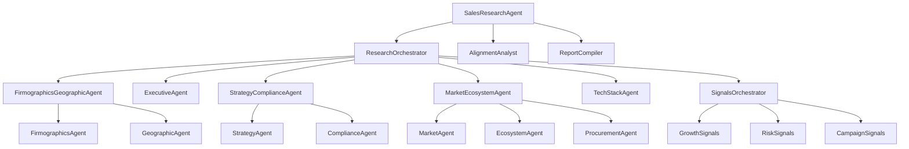

# Sales Research Agent Architecture

The sales ADK graph runs as a sequential pipeline with a parallel research phase followed by synthesis and final report compilation.

## Prompt Modules

Prompts are now grouped by domain and exposed through compatibility shims:

- `prompt_common.py` for shared PlanReAct workflow blocks.
- `company_prompts.py` for firmographics, geographic, and executive prompts.
- `strategy_market_prompts.py` for strategy, compliance, market, ecosystem, technology, and procurement prompts.
- `signal_prompts.py` for growth/risk/campaign prompts.
- `synthesis_alignment_prompts.py` and `synthesis_report_prompts.py` for synthesis stages.

Legacy imports from `research_prompts.py` and `synthesis_prompts.py` continue to work.
